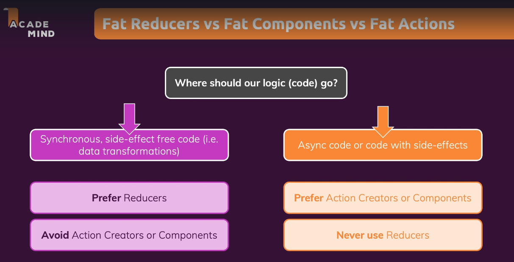
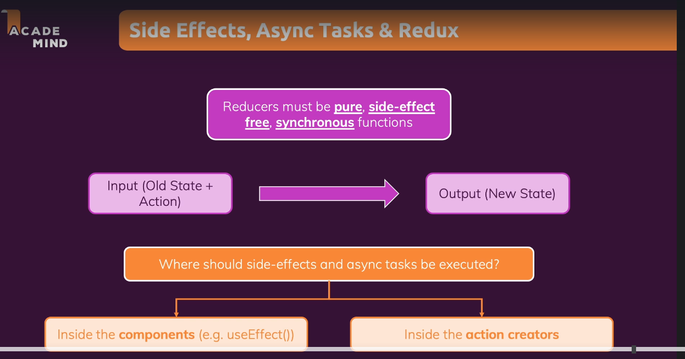
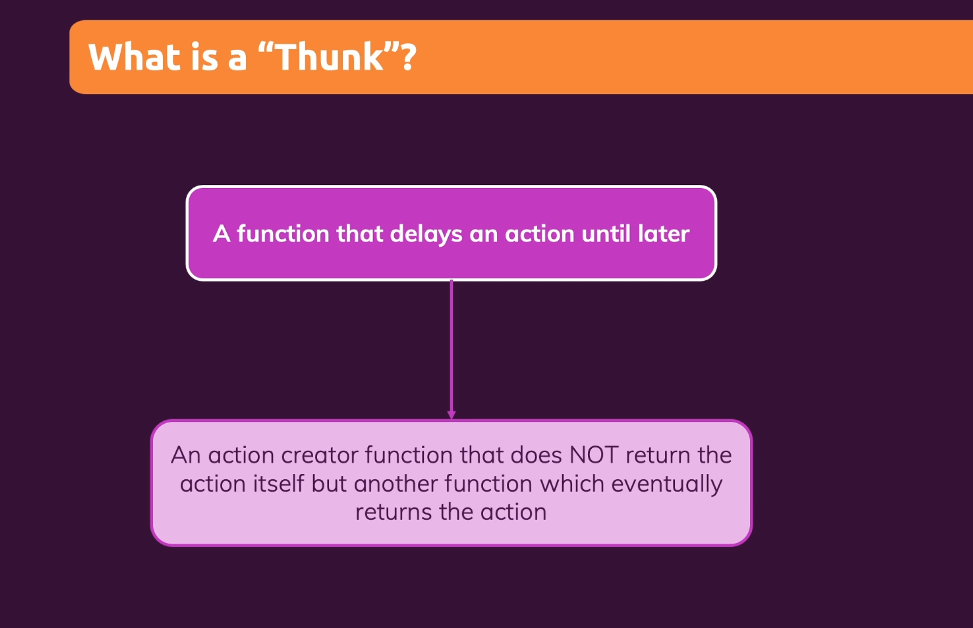
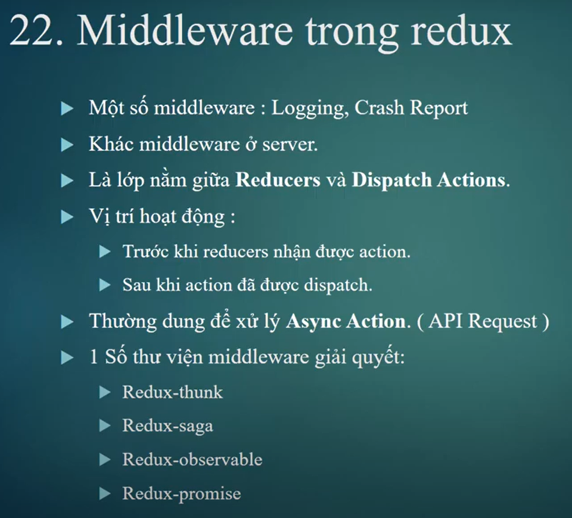
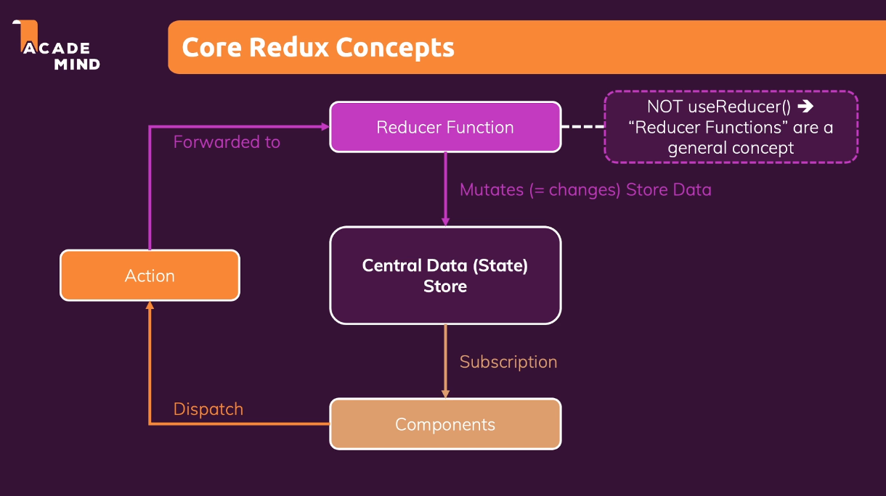

# DEMO FETCH DATA THROUGH FIREBASE USING REDUX THUNK

using creator function thunk to work with asynchronous code

## Where to put async code

It is a best practice to put all the `logic code` to `reducer`, and `async code` in `component` or `action creator thunk`

 

---

 

---

## What is a Thunk

(it used with `redux toolkit` we also create `thunk creator action` with `redux thunk`)

**_thunk_**: is an action creator that return another `callback async function` - and inside that callback function it will do `async code` and `dispatch other action` - the callback function will be executed by `redux toolkit` or `redux thunk`

lecture: 258

**_xem lai folder fetch data using redux thunk_** - this folder not using `redux toolkit` - it use `redux thunk`

 

**_NOTE:_** use `redux toolkit` to create `action creator thunk` to run async code in the `action`;

**_Async Action_**: là action chưa sẵn sàn được gọi, sử dụng `redux toolkit` hoặc `redux thunk` để tạo ra `action creator thunk` để trì hoãn việc dispatch => fetch dữ liệu xong mới dispatch

`Thunk` is an `function` - that `delay` an `action` util something else finished

 

---

### Redux middleware

Sinh ra để tối ưu performance cho code

Để không cần `dispatch` data sau khi call `APIs`, ta cần dùng `middleware` redux-thunk, redux-saga => call `APIs` ngay trong action

 

---

Ta `call APIs` trong `action` không cần thông qua component

Nói ngắn gọn `middleware` giúp chúng ta xử lý bất đồng bộ trong `action`, **_dispatch an action in action_**

---

# Redux in FUNCTIONAL COMPONENT

1. There is one `store` to store all the `state` data and pass down data to all component
2. => component never directly mutate `state`, component just `dispatch action` to reducer
3. => `reducer` will process all the logic and return `state` to store
4. => component will connect/subscribe to `store` and use that data

 

---

**_In the component:_**

- `useSelector` and `useStore` => `react-redux` will automatically manage `connect` our component to redux store =>allow `retrieve` state from **_store to component_** by callback function will be call by redux

-`useDispatch` help us to `dispatch` `action` from **_component to store_**

---
